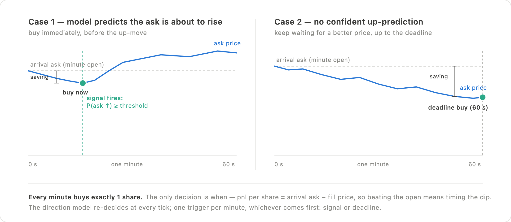
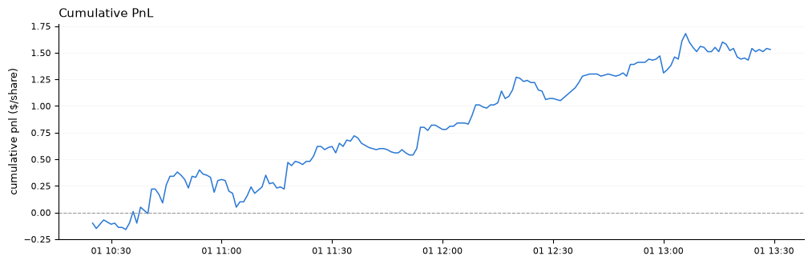
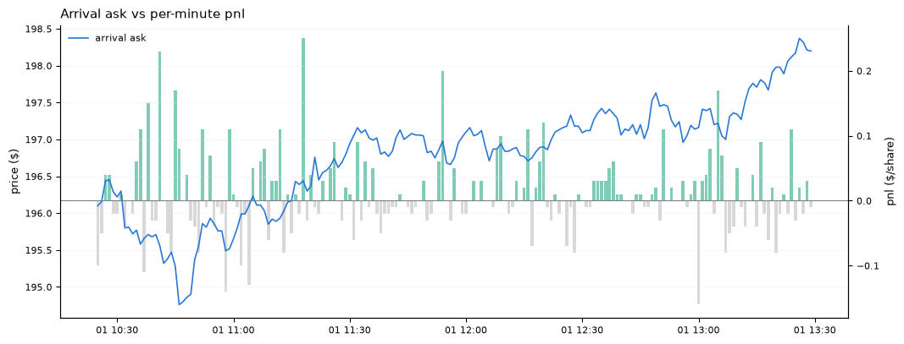
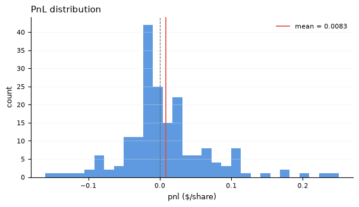
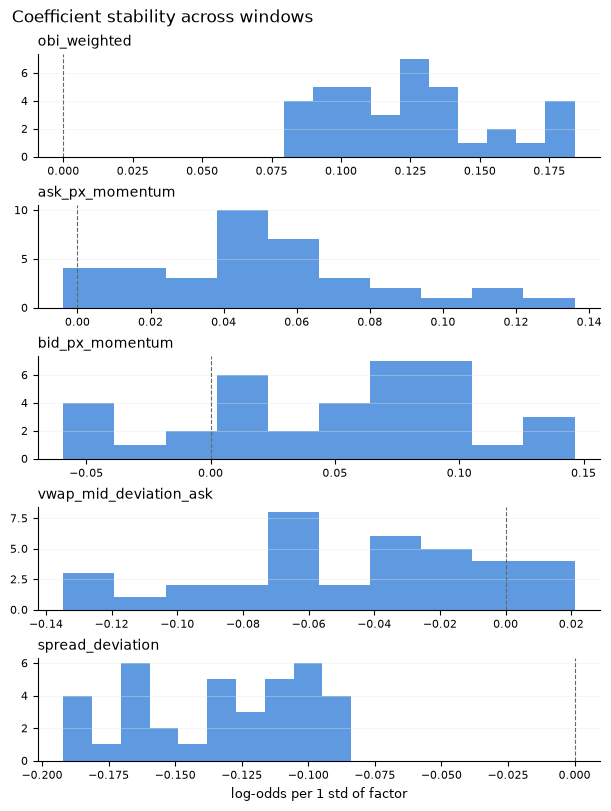

# Intra-Minute Execution Timing

**Beating the arrival price with order-book signals: a walk-forward backtest of intra-minute execution timing on NVDA tick data.**

The task: buy exactly 1 share per minute at the best ask — the only freedom is *when* within each minute. A logistic regression trained on top-of-book features (MBP-10) predicts whether the ask is about to rise; a predicted rise triggers an immediate buy, otherwise the strategy keeps waiting for a better price, up to a deadline buy at minute-end.



## Headline result


_Cumulative savings vs buying at each minute's open — \$1.53 in total over 185 one-share trades (2026-07-01, ~\$0.008/share on average), retraining on a purged walk-forward window. NVDA rose ~\$3.50 over the session, so drift worked **against** waiting: every naive timing rule loses money on this day._

## Results

Per-minute pnl = arrival ask − fill price (per share): positive means beating "buy immediately at minute open". The interesting comparison is against naive timing rules on the same minutes (2026-07-01, computed from the same tick data):

| Timing rule | Mean pnl / share |
|---|---|
| Buy immediately at minute open | $0.000 (by definition) |
| Buy at a random tick in the minute | −$0.005 |
| Always wait until minute end | −$0.011 |
| **Model-timed (this strategy)** | **+$0.008** |
| Perfect foresight (buy the minute's low) | +$0.110 |

On a rising day, waiting is a losing game by default — random timing and always-waiting both bleed money. The model still comes out positive (~40% of the average spread per trade, win rate 0.43), beating every naive rule while capturing ~8% of the perfect-foresight bound.

The per-minute pnl lines up with the price path as designed — the strategy waits through falling stretches and buys early ahead of predicted up-moves:



Wins and losses are both frequent, but the right tail is heavier — the edge comes from asymmetry, not from winning every minute:



The main factors keep a stable sign across all 37 walk-forward retrainings (order-book imbalance consistently positive, spread deviation consistently negative; the momentum factors are noisier), evidence the model is picking up structure rather than window-specific noise:



### Backtest II: same settings, opposite trend

As a robustness check, the identical pipeline — hyperparameters tuned on 2026-07-01 only, nothing re-fit — was re-run on 2026-07-02, a falling day (`5.strategy_backtest_II.ipynb`). The strategy makes +\$0.017/share (win rate 0.52), but on a falling day simply always waiting until minute-end earns +\$0.027/share: most of that pnl is drift capture rather than timing skill, and the model's early triggers actually cost money vs pure waiting. The two days bracket the honest conclusion — the signal adds real timing value against adverse drift, and over-triggers when drift is favorable.

Backtest III (`6.strategy_backtest_III.ipynb`) repeats the check on a third, well-separated day (2026-07-17): the model earns +\$0.005/share while both naive rules lose (random tick −\$0.011, always-wait −\$0.008) — the same pattern as day 1, in a different market regime.

**Caveats**: holdout-period results are weaker on both days (mean pnl ≈ $0.005/share); the per-day t-stat is only ~1.8; and the average edge (< 1 tick) assumes zero execution latency (`execution_lag_ticks=0`). This is a research exercise in methodology — purged walk-forward validation, leakage-free signal timing, benchmark-relative execution pnl — not yet a deployable strategy.

## Pipeline

| Notebook | Contents |
|---|---|
| `1.exploratory_data_analysis.ipynb` | Raw MBP-10 data structure, price/spread/depth visualization |
| `2.feature_engineering.ipynb` | Factor & label construction, correlation analysis, factor hyperparameter search |
| `3.prediction_model.ipynb` | Direction model (logistic regression) and volatility model (ridge) fitting & evaluation |
| `4.strategy_backtest_I.ipynb` | Walk-forward backtest on 2026-07-01 (upward-trending day) + holdout validation |
| `5.strategy_backtest_II.ipynb` | Same pipeline, unchanged hyperparameters, on 2026-07-02 (downward-trending day) |
| `6.strategy_backtest_III.ipynb` | Same pipeline, unchanged hyperparameters, on 2026-07-17 (a well-separated third day) |

Supporting package `execution_timing/`:

- `data_download.py` / `data_loading.py` — fetch (Databento) and load/trim raw ticks
- `feature_engineering.py` — order-book factors (weighted OBI, spread deviation, price momentum, VWAP-mid deviation) and forward-looking labels
- `rolling_window_generator.py` — purged walk-forward train/test windows
- `prediction_model.py` — scaler + sklearn model wrapper
- `trading_strategy.py` — thresholds predicted probability into a 0/1 trade-now signal
- `trading_simulator.py` — executes the signal against raw ticks under the 1-share-per-minute contract; per-minute pnl vs arrival price
- `config.py` — tuned factor/label hyperparameters shared across notebooks
- `visualization.py` — plotting helpers used throughout

## Design choices worth noting

- **No lookahead anywhere in the signal path**: signals are timestamped by the tick that produced them (not resample-bin labels), fills are looked up in raw tick data at or after the decision time, and train/test windows are separated by a purge gap.
- **Decision grid vs price grid are decoupled**: the signal can be evaluated on a coarser grid while fills always come from raw ticks, so decision cadence is a tunable cost/quality tradeoff.
- **Benchmark-relative evaluation**: every minute records arrival/mean/min/max ask alongside the fill, so the strategy can be compared against buy-immediately, random-timing, always-wait, and perfect-foresight baselines from one result table.

## Setup

Data is NVDA MBP-10 (Nasdaq XNAS.ITCH) from [Databento](https://databento.com), which cannot be redistributed — see `data_raw/README.md` for how to download it with your own API key.

```bash
python -m venv .venv && source .venv/bin/activate
pip install -r requirements.txt
echo "DATABENTO_API_KEY=<your key>" > .env
python execution_timing/data_download.py   # fetches parquet files into data_raw/
```

Then run the notebooks in order (each is self-contained after the data exists).
